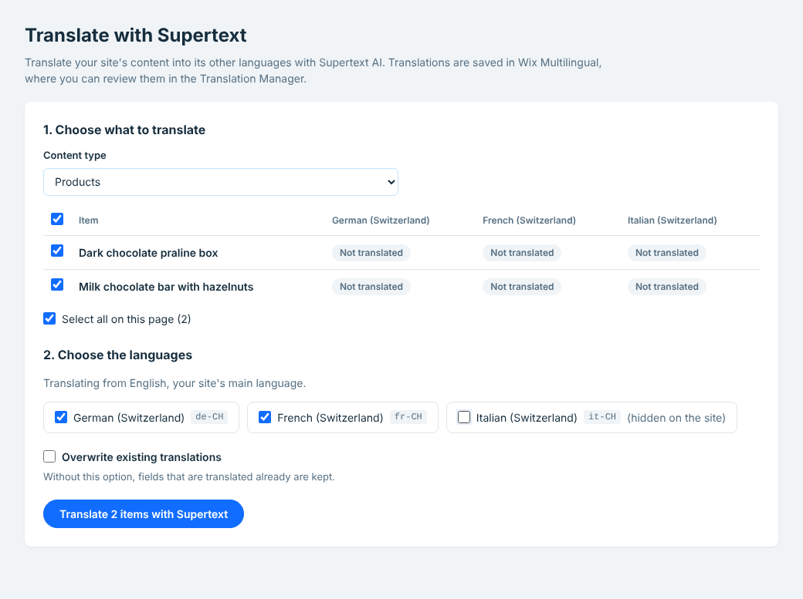

# Supertext Translation for Wix

Translate your Wix site's content with [Supertext](https://www.supertext.com) AI, right from the Wix dashboard: Wix Stores products and categories, Wix Blog posts and other content that Wix Multilingual can translate. Pick the items and the languages, click **Translate with Supertext**, and review the result in Wix's Translation Manager.

> **Status: in development.** The app works against a stand-in of the Wix APIs (tests, screenshots). Testing on a real Wix site with Wix Stores and Wix Multilingual is the next step; see [Known limitations](docs/DEVELOPER.md#known-limitations--roadmap).

- **Wix app** with a dashboard page, hosted by Supertext (Node.js on Railway). Nothing to install on the site but the app itself.
- Works through **Wix Multilingual**: it reads the original texts and writes the translations where Wix keeps them, so they show up in the Translation Manager and on the live site.
- Keeps formatting: rich text keeps headings, lists, bold, italics and links.
- Doesn't touch what you translated by hand unless you choose **Overwrite existing translations**.
- The app's own pages are in English, German, French and Italian, following your dashboard language.

**Needs:** a Wix site with Wix Multilingual and at least one more language, and a Supertext account with an API key. No Supertext account yet? [Create one at supertext.com](https://www.supertext.com/person/en/account/signin). Generate your API key at [supertext.com → Integrations → API](https://www.supertext.com/en/integrations/api) (requires the Admin role).

## Guides

- [Installation guide](docs/INSTALLATION.md): for site owners and administrators — install, API key, languages, settings, troubleshooting.
- [User guide](docs/USER_GUIDE.md): for editors — translating, reviewing, what is and isn't translated.
- [Developer guide](docs/DEVELOPER.md): architecture, Wix and Supertext APIs, local development, tests, hosting, releasing.

Changes are listed in the [changelog](CHANGELOG.md).

<!-- supertext-plugins:start (shared list, keep identical in every Supertext plugin repo) -->
## Supertext plugins for other systems

Supertext offers AI and professional translation plugins for these systems:

### Content management systems (CMS)

| System | Plugin | Type of integration | What it does |
| --- | --- | --- | --- |
| Adobe Experience Manager | [supertext-aem-connector](https://github.com/Supertext/supertext-aem-connector) | Translation connector: two AEM content packages for AEM's Translation Integration Framework. | Sends AEM translation projects to Supertext and imports the results |
| Contao | [Contao-Supertext-Translation](https://github.com/Supertext/Contao-Supertext-Translation) | Contao bundle (Composer) that adds a back-end action. | *Translate with Supertext* in the site structure: pages or whole websites into other languages |
| Craft CMS | [CraftCms-Supertext-Translation](https://github.com/Supertext/CraftCms-Supertext-Translation) | Craft plugin (Composer) with a panel on the entry page. | Translates entries into your other sites, Matrix and rich text included |
| Directus | [Directus-Supertext-Translation](https://github.com/Supertext/Directus-Supertext-Translation) | Directus extension bundle (npm): interface, endpoint, Flow operation and module. | *Translate with Supertext* box on the item form, fills the Translations field |
| django CMS | [djangoCMS-Supertext-Translation](https://github.com/Supertext/djangoCMS-Supertext-Translation) | Django app (Python package) that adds a toolbar entry. | Translates pages and their plugins from the toolbar |
| Drupal | [tmgmt_supertext_ai](https://www.drupal.org/project/tmgmt_supertext_ai) | Drupal module: a translator provider for the Translation Management Tool (TMGMT), by MD Systems. | Translates TMGMT jobs with Supertext AI |
| Ghost | [Ghost-Supertext-Translation](https://github.com/Supertext/Ghost-Supertext-Translation) | Separate connector service (Ghost has no admin plugins): works through internal tags, webhooks and the Admin API. | Tag a post `#translate-…` and a translated draft appears |
| Grav | [Grav-Supertext-Translation](https://github.com/Supertext/Grav-Supertext-Translation) | Grav 2 plugin with an Admin2 panel. | Supertext panel in the page editor, Markdown kept intact |
| Joomla | [Joomla-Supertext-Translation](https://github.com/Supertext/Joomla-Supertext-Translation) | Joomla system plugin (installable package). | Translates articles into linked, unpublished language versions |
| Magnolia | [Magnolia-Supertext-Translation](https://github.com/Supertext/Magnolia-Supertext-Translation) | Magnolia module with a *Translate with Supertext* action in the Pages app. | Translates pages, areas and components into the site's other languages |
| Neos | [Neos-Supertext-Translation](https://github.com/Supertext/Neos-Supertext-Translation) | Neos package (Composer) that hooks into the content repository; no new UI. | Translates automatically when an editor creates a page in another language |
| Orchard Core | [OrchardCore-Supertext-Translation](https://github.com/Supertext/OrchardCore-Supertext-Translation) | Orchard Core module (.NET) with an admin page and a localization hook. | Translates content items into other cultures, on demand or on localization |
| Payload CMS | [Payload-Supertext-Translation](https://github.com/Supertext/Payload-Supertext-Translation) | Payload plugin (npm) added to `payload.config`. | *Translate* button for localized collections and globals |
| Silverstripe | [Silverstripe-Supertext-Translation](https://github.com/Supertext/Silverstripe-Supertext-Translation) | Silverstripe module (Composer) on top of Fluent. | Supertext tab translates pages and Elemental blocks into Fluent locales |
| Strapi | [Strapi-Supertext-Translation](https://github.com/Supertext/Strapi-Supertext-Translation) | Strapi 5 plugin (npm) with a Content Manager panel. | Translates entries into other locales from the Content Manager |
| TYPO3 | [Typo3-Supertext-Translation](https://github.com/Supertext/Typo3-Supertext-Translation) | TYPO3 extension (Composer) that hooks into TYPO3's own localization; no new UI. | Translates pages and content elements as editors localize them |
| Umbraco | [Umbraco-Supertext-Translation](https://github.com/Supertext/Umbraco-Supertext-Translation) | Umbraco package (NuGet) with a backoffice extension. | *Translate with Supertext* for pages, block lists and grids included |
| Wagtail | [Wagtail-Supertext-Translation](https://github.com/Supertext/Wagtail-Supertext-Translation) | Python package: a machine translator for wagtail-localize. | Translates pages and snippets inside wagtail-localize's editor |
| WordPress (Polylang) | [supertext-wordpress-polylang](https://github.com/Supertext/supertext-wordpress-polylang) | WordPress plugin: a machine-translation service for Polylang Pro, plus professional translation orders. | AI translation next to DeepL in Polylang, and human translation orders |

### Product information management (PIM)

| System | Plugin | Type of integration | What it does |
| --- | --- | --- | --- |
| Akeneo PIM | [Akeneo-Supertext-Translation](https://github.com/Supertext/Akeneo-Supertext-Translation) | Akeneo PIM bundle with a *Translate with Supertext* action on the product page. | Translates products and product models into your other locales |
| AtroPIM | [AtroPIM-Supertext-Translation](https://github.com/Supertext/AtroPIM-Supertext-Translation) | AtroCore module with a button on the product and a mass action in the list. | Translates products and other AtroCore records into your other languages |
| Pimcore | [Pimcore-Supertext-Translation](https://github.com/Supertext/Pimcore-Supertext-Translation) | Pimcore bundle (Composer) with a *Translate with Supertext* button in Pimcore Studio. | Translates documents into linked language versions and data objects' localized fields |

### E-commerce

| System | Plugin | Type of integration | What it does |
| --- | --- | --- | --- |
| Magento | [Magento-Supertext-Translation](https://github.com/Supertext/Magento-Supertext-Translation) | Magento 2 module (also Mage-OS) with a mass action in the admin lists and a button on the edit pages. | Translates products, categories, CMS pages and blocks into your store views' languages |
| PrestaShop | [PrestaShop-Supertext-Translation](https://github.com/Supertext/PrestaShop-Supertext-Translation) | PrestaShop module with a bulk action in the back-office lists. | Translates products, categories and CMS pages into your shop's other languages |
| Shopify | [Shopify-Supertext-Translation](https://github.com/Supertext/Shopify-Supertext-Translation) | Shopify app in the Shopify admin. | Translates products, collections, pages and blog posts into all your shop's languages |
| Wix | [Wix-Supertext-Translation](https://github.com/Supertext/Wix-Supertext-Translation) | Wix app with a dashboard page (hosted service), working through Wix Multilingual. | *In development:* translates Wix Stores products and other Wix Multilingual content into your site's languages |

### Design files (XLIFF round trip)

| Application | Plugin | Type of integration | What it does |
| --- | --- | --- | --- |
| Adobe InDesign | [Adobe-InDesign-Translation](https://github.com/Supertext/Adobe-InDesign-Translation) | InDesign scripts (ExtendScript). | Exports all text to XLIFF 1.2 for any CAT tool and imports the translations with formatting intact |
| Adobe Illustrator | [Adobe-Illustrator-Translation](https://github.com/Supertext/Adobe-Illustrator-Translation) | Illustrator scripts (ExtendScript). | Exports all text to XLIFF 1.2 for any CAT tool and imports the translations with formatting intact |
| CorelDRAW | [CorelDRAW-Supertext-Translation](https://github.com/Supertext/CorelDRAW-Supertext-Translation) | CorelDRAW VBA macro. | Exports all text to XLIFF 1.2 for any CAT tool and imports the translations with formatting intact |
<!-- supertext-plugins:end -->

## License

MIT, see [LICENSE](LICENSE).
