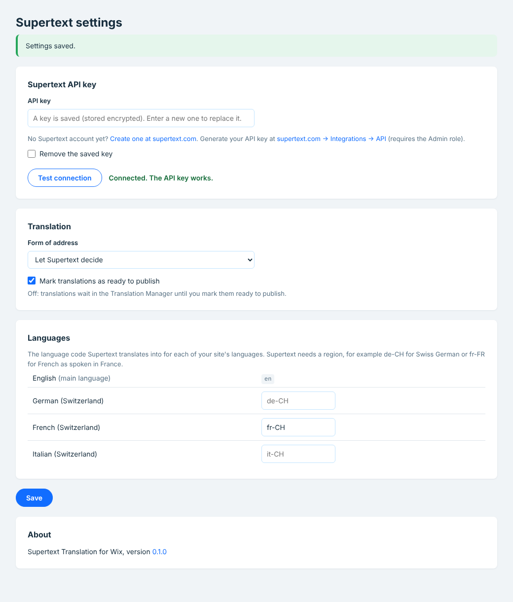
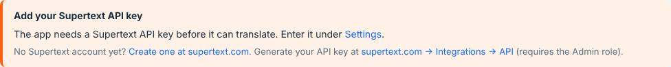

# Installation guide — Supertext Translation for Wix

For site owners and administrators setting up Supertext Translation on a Wix site.

> **Status: in development.** The app is tested against a stand-in of the Wix APIs. It isn't in the Wix App Market yet, and it hasn't been tried on a real Wix Stores site. Ask Supertext before using it on a live site.

## How it works

Supertext Translation is a Wix app. It adds a **Translate with Supertext** page to your site's dashboard. The app runs on Supertext's servers: it reads the texts to translate from **Wix Multilingual**, has Supertext AI translate them, and saves the translations back to Wix Multilingual. You review and publish them there, as with translations you make by hand.

Nothing is installed on your site except the app itself, and the app only changes translations, never your original content.

## Requirements

| | |
| --- | --- |
| Wix site | Any Wix or Wix Studio site with the content you want to translate, for example a Wix Stores shop or a Wix Blog |
| Wix Multilingual | Added to the site, with at least one language besides the main language (step 2) |
| Supertext | An account with an API key, see [Get a Supertext account and API key](#1-get-a-supertext-account-and-api-key) |
| Permissions | Adding apps to the site (site owner or an admin collaborator) |

## 1. Get a Supertext account and API key

1. **Account:** no Supertext account yet? [Log in or create one](https://www.supertext.com/person/en/account/signin) with your email address.
2. **API key:** generate it at [supertext.com → Integrations → API](https://www.supertext.com/en/integrations/api). Only users with the **Admin** role in the Supertext account can do this; otherwise ask your Supertext account admin for a key.

The app's settings page links to both, next to the API key field.

## 2. Set up your languages in Wix Multilingual

The app translates into the languages your site has in Wix Multilingual, from the site's main language.

1. In your site's dashboard, open **Wix Multilingual** (search the dashboard for "Multilingual" if you don't see it; add it if it isn't on the site yet).
2. Add each language you want, with its region where it matters (for example *German (Switzerland)*). A language can stay hidden from visitors while you translate; the app translates hidden languages too.

Wix Multilingual decides which content can be translated: what it lists in its Translation Manager (Wix Stores products and categories, Wix Blog posts and other apps' content) is what the app offers.

## 3. Install the app

The app isn't in the Wix App Market yet. Supertext sends you an install link for your site; open it while logged in to Wix, choose the site and confirm the permissions:

| Permission (as Wix shows it) | Why |
| --- | --- |
| Wix Multilingual – read translation content | Read the original texts and existing translations |
| Wix Multilingual – write translation content | Save the translations |
| Wix Multilingual – manage translations | Read the site's languages |

After installing, the app appears in your dashboard's sidebar under **Apps** as **Supertext Translation**.

## 4. Enter the API key

Open **Supertext Translation → Settings** in the dashboard:

1. Paste your key into **API key** and click **Save**. You can paste it exactly as Supertext shows it, with the leading `Supertext-Auth-Key`, or without it. The key is stored encrypted.
2. Click **Test connection**. *Connected. The API key works.* means everything is in place.

Until a key is saved, the translate page asks for one:

## All settings

All settings are per site, in **Supertext Translation → Settings**.

| Setting | Default | Purpose |
| --- | --- | --- |
| API key | – | Your Supertext key, with or without the `Supertext-Auth-Key` prefix; stored encrypted. *Remove the saved key* deletes it. |
| Test connection | – | Checks the key (entered or saved) with Supertext, without translating anything |
| Form of address | Let Supertext decide | *Formal* (German "Sie", French "vous") or *Informal* ("du", "tu") |
| Mark translations as ready to publish | On | On: translations go live on the site's language versions right away. Off: they wait in the Translation Manager until you mark them ready to publish. |
| Languages | the site language's code | The Supertext code each site language is translated into. Supertext needs a region (e.g. `de-CH`, `fr-FR`); a site language without one (e.g. *German*) is sent with a default region (`de-DE`). |

The settings page also shows the app's version, linked to its release notes.

## Who can translate

Everyone who can open the app's pages in the site's dashboard: the site owner and collaborators whose role gives access to apps. The app checks on every request that it comes from the Wix dashboard of that site (Wix's signed app instance).

## Updating

Nothing to do: the app runs on Supertext's servers and is updated there. The settings page shows the current version.

## Uninstalling

In your site's dashboard, open **Apps → Manage Apps**, find **Supertext Translation** and remove it. Translations made so far stay in Wix Multilingual. The app deletes your settings (including the stored API key) when Wix tells it the app was removed.

## Troubleshooting

| Message | Cause / fix |
| --- | --- |
| *This page has expired. Reload it from the Wix dashboard.* | The app's page was opened outside the dashboard or the link is too old. Open it again from the sidebar. |
| *Add your Supertext API key* / *No Supertext API key configured* | Enter the key under Settings (step 4). |
| *Authentication failed* | The key is wrong or revoked. Check it with **Test connection**; if needed, generate a new one at [supertext.com → Integrations → API](https://www.supertext.com/en/integrations/api) (Admin role required). |
| *Add a second language* | Wix Multilingual has only the main language. Add languages (step 2). |
| *Wix Multilingual isn't set up on this site* | Add Wix Multilingual and a second language (step 2). |
| *Wix Multilingual has no translatable content on this site yet* | Nothing on the site uses Wix Multilingual's translation yet (for example no products). Add content in the main language. |
| *Wix refused the request* | The app lacks a permission, for example after Wix added a new one. Reinstall the app to grant it. |
| *Supertext doesn't translate into …* | Set the language's Supertext code under Settings → Languages, with a region (e.g. `de-CH`). |
| *… too long for Wix, not saved* | The translation is longer than Wix allows for that field (e.g. a product name). Shorten it by hand in the Translation Manager. |
| *Too many requests to Supertext* | Supertext's per-second limit was still exceeded after 4 automatic retries. Wait a moment and translate again. |
| *Your Supertext translation limit is exceeded* | Your Supertext plan's volume is used up. |
| *The app restarted during the translation* | Start the translation again; items already done are kept (they show *Already translated, unchanged*). |

## Privacy and security

- The texts you translate are sent to Supertext (api.supertext.com) and deleted there right after download (they expire after 24 hours anyway).
- The app stores per site: the Supertext API key (encrypted), the settings above, and the list of recent translations (item names and results). It doesn't store your content.
- The app never changes your site's original texts; it only writes translations.
