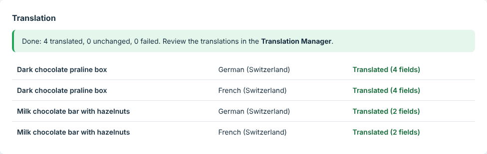
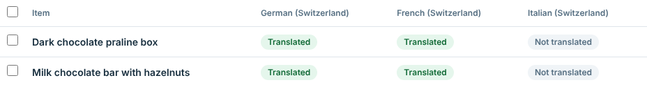
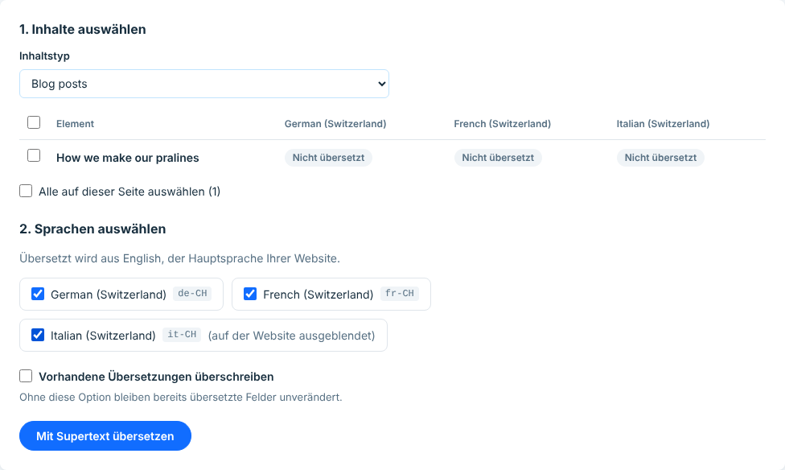
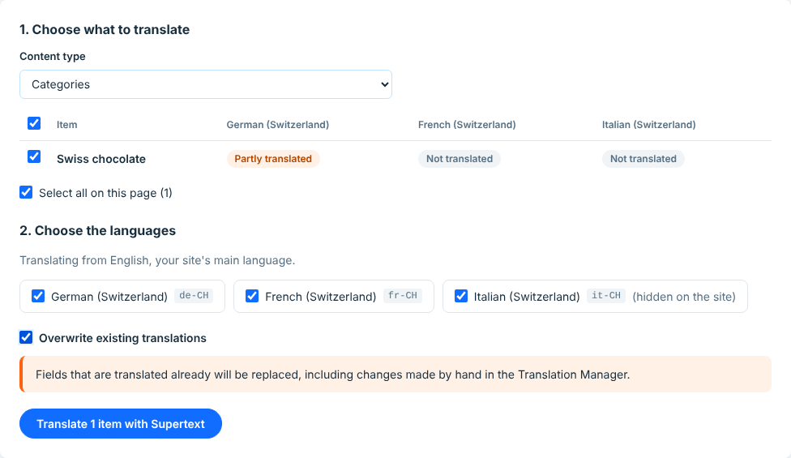

# User guide — Supertext Translation for Wix

For editors. Once the app is set up (see [INSTALLATION.md](INSTALLATION.md)), you translate your site's products, categories, blog posts and other content from the Wix dashboard. The translations are saved in Wix Multilingual, where you review them like translations made by hand.

*Screenshots: the app's pages with sample content (a Swiss chocolate shop in English, with German, French and Italian for Switzerland).*

## Translate

1. In your site's dashboard, open **Apps → Supertext Translation**.
2. Under **Content type**, choose what to translate, for example **Products** (Wix Stores). The list shows the items in your site's main language and, for each language, how far they are translated: *Not translated*, *Partly translated* or *Translated*.
3. Tick the items, or **Select all on this page**. Long lists have **Next page**.
4. Under **Choose the languages**, tick the languages to translate into. All are ticked at first; the code next to each (e.g. `de-CH`) is the variant Supertext translates into. Languages hidden from visitors are marked *(hidden on the site)*.
5. Click **Translate 2 items with Supertext**.

   

6. Each item and language takes a few seconds. The **Translation** box shows the result as it goes, and a summary at the end. You can leave the page meanwhile; the translation goes on, and the box shows the last result when you come back.

   

The list then shows the new state:

The app's pages follow your dashboard language (English, German, French or Italian):

## Review

Open **Wix Multilingual's Translation Manager**, choose the language and the item: the translated fields are filled in, marked as translated by an app. Correct anything you like there.

Whether translations go live right away is a setting (*Mark translations as ready to publish*, on by default). When it's off, translations wait in the Translation Manager until you mark them ready to publish. A language that is hidden from visitors stays hidden either way.

## Existing translations

Without any option, the app only fills fields that have **no translation yet** in that language. Fields translated already, by you or by the app, are kept, and the result says so: *Translated (1 field) · 1 kept*, or *Already translated, unchanged* when there was nothing left to do.

To replace existing translations, tick **Overwrite existing translations**. The page warns you first: changes made by hand in the Translation Manager are lost.

## What is translated

Everything Wix Multilingual offers for translation, as far as it is text:

| Content | Examples |
| --- | --- |
| Wix Stores | Products (name, description, options, SEO texts), categories |
| Wix Blog | Posts (title, excerpt, content) |
| Other apps | Whatever else Wix Multilingual lists in the Translation Manager, as long as it has text fields |

- **Text fields** (names, titles, SEO texts) are translated as plain text.
- **Rich text** (product descriptions, blog post content) keeps its headings, lists, bold, italics, underlining and links. Each paragraph is translated as a whole. Button labels and image descriptions (alt texts) in rich text are translated too; code blocks aren't.
- **HTML fields** keep their markup.
- **Not translated:** images, videos and documents, and fields Wix marks as display-only. Your site's own pages and texts in the Wix Editor are translated in the Wix Editor or Wix Multilingual, not by this app (yet).

The app never changes the original texts in your main language.

## When something goes wrong

The result shows the reason for each item and language that fails; the other ones still run. Authentication and limit problems stop the whole translation.

| Message | What to do |
| --- | --- |
| *Add your Supertext API key* | An administrator needs to enter the API key under Settings. |
| *Authentication failed* | The API key is no longer valid; tell your administrator. |
| *Supertext doesn't translate into …* | The language needs a Supertext code with a region; an administrator sets it under Settings → Languages. |
| *… too long for Wix, not saved* | The translation is longer than Wix allows for that field. Shorten it by hand in the Translation Manager. |
| *Supertext returned 3 of 4 texts; nothing was saved for this item.* | Try that item again. |
| *Too many requests to Supertext* | Wait a moment and click **Translate** again. Items already done show *Already translated, unchanged*. |
| *Your Supertext translation limit is exceeded* | Your Supertext plan's volume is used up; tell your administrator. |
| *This page has expired* | Open the app again from the dashboard's sidebar. |
